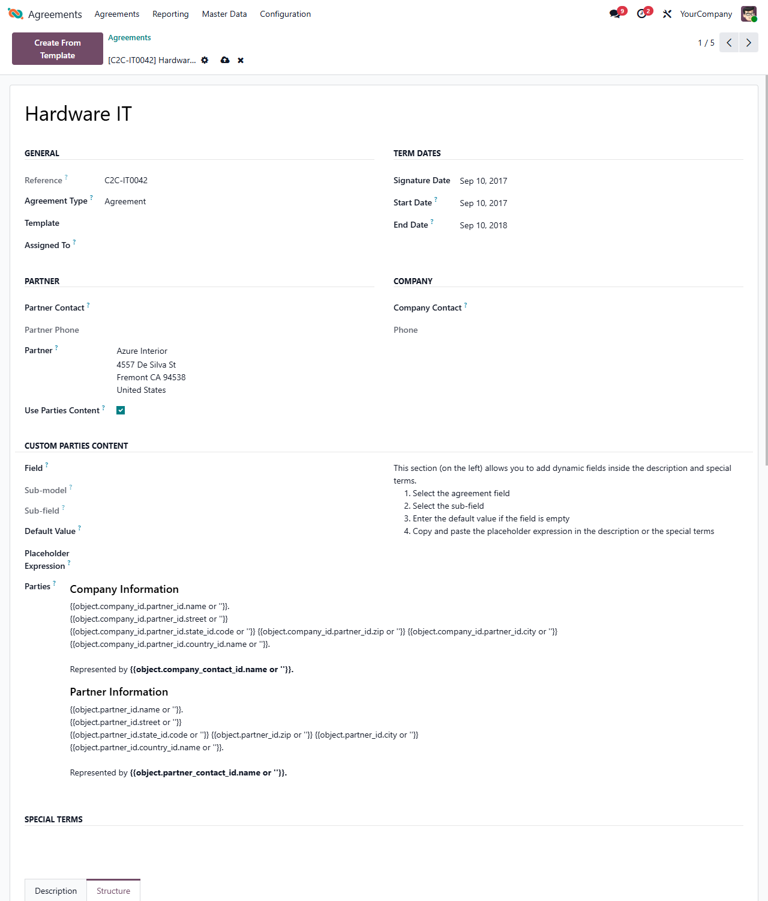
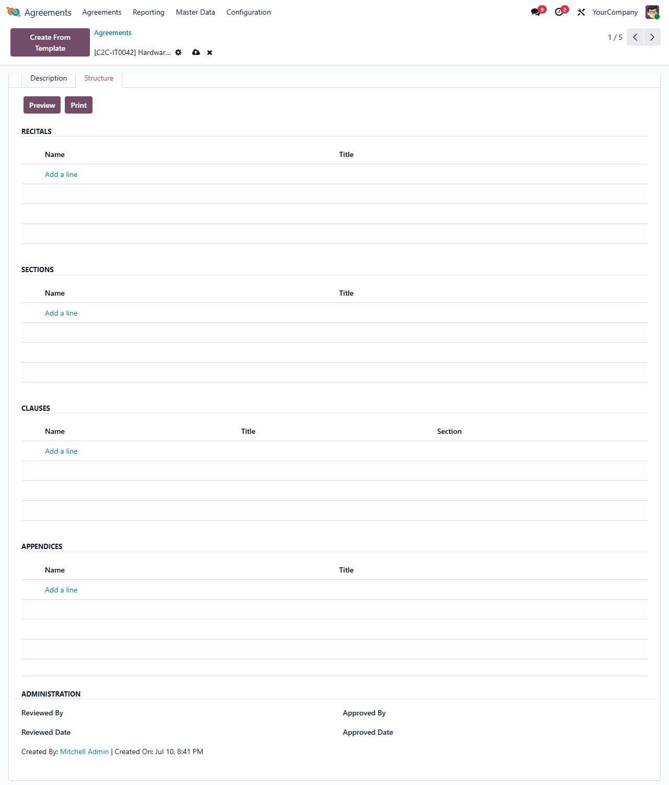

This module adds dynamic placeholder content to legal agreements and their
sections, clauses, recitals and appendices.

It provides the `agreement.dynamic.content.mixin` placeholder-expression builder
(select a field and copy/paste the resulting placeholder into the content), the
computed `dynamic_*` fields that render those placeholders through the mail
template engine, and the PDF/preview report that prints the rendered content.

